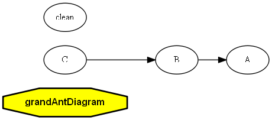

## Ant Dependency View

Ant target to visualize the flow and dependencies


# Dependecies

1. [Git](https://git-scm.com/downloads)
2. [Ant](https://ant.apache.org/bindownload.cgi)
3. [Graphviz](http://www.graphviz.org/Download.php)


# How to use

Clone

```
git clone https://github.com/humbertodias/ant-dependency-view.git
```

Inside the folder

```
cd ant-dependency-view
```

Build

```
ant 
```


# Output

	build.png and build.pdf

	

# References

* [Git](https://git-scm.com/downloads)

* [Ant](https://ant.apache.org/bindownload.cgi)

* [Graphviz](http://www.graphviz.org/Download.php)
